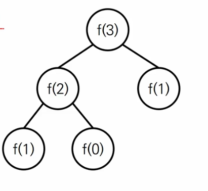

# 재귀 

## 1.패턴이존재한다

```go
func recursive(n int)int {
	if n >= '특정값'{
	    return recursive('입력값보다 작은 수') + '연산'	    
	}
	
	return '특정값' // 재귀종료
}
```


## 2.재귀호출의 한게지점이 존재한다
- 파이썬의경우 스택이 1000까지만 쌓일 수 있음


## 3.시간초과를 항상 고려해야한다
- 예시문제
  - 피보나치
- 시간초과를 고려할때는 그래프를 그려보는게 좋다.
- 
  - 수가 많을수록 그래프는 더욱 넓어지고 깊어진다 
  - 시간복잡도 : O(2^n)

### 3.1.시간초과를 방지하기위해서는 다이나믹 프로그래밍을 활용하거나, 반복문으로 풀어야한다